# Plateforme de gestion des événements – ENSAM Casablanca

## Introduction

Ce projet est une application web dédiée à la gestion des événements académiques et associatifs au sein de l’ENSAM Casablanca. La plateforme permet de centraliser les événements organisés par les clubs et les différentes entités de l’école, tout en facilitant leur création, leur suivi et la participation des étudiants.

L’application offre des espaces distincts selon le rôle de l’utilisateur, avec une interface claire et une gestion sécurisée des accès.

---

## Objectif du projet

L’objectif principal du projet est de proposer une plateforme web centralisée pour la gestion des événements de l’ENSAM Casablanca.

Les objectifs secondaires sont :

* Centraliser l’ensemble des événements dans une seule application
* Améliorer l’organisation et le suivi des événements
* Faciliter l’inscription et la participation des étudiants
* Offrir une gestion claire des clubs et des utilisateurs
* Assurer la fiabilité et la cohérence des données

---

## Rôles et fonctionnalités

### Administrateur

* Gestion des utilisateurs et des rôles
* Supervision globale de la plateforme
* Gestion des clubs et des événements
* Contrôle des accès

### Organisateur (Président de club)

* Création d’événements
* Modification et suppression des événements
* Consultation des inscriptions
* Suivi des participants

### Utilisateur / Étudiant

* Consultation des événements
* Inscription aux événements
* Accès aux détails des événements
* Consultation de l’historique des inscriptions

---

## Architecture du projet

L’application repose sur une architecture **MVC (Model – View – Controller)**.

* **Model** : entités JPA représentant les données (Utilisateur, Club, Événement, Inscription, etc.)
* **Controller** : gestion des requêtes HTTP et de la navigation
* **Service** : logique applicative
* **Repository** : accès aux données via Spring Data JPA
* **View** : interfaces utilisateur développées avec Thymeleaf et des layouts réutilisables

Cette organisation permet une séparation claire des responsabilités et une maintenance facilitée.

---

## Base de données

La base de données utilisée est **SQL Server**.

Principales entités :

* Utilisateur
* Rôle
* Ensamien
* Club
* Événement
* Inscription
* Adhésion
* Badge

Des énumérations sont utilisées pour la gestion des statuts et de la visibilité :

* StatutEvenement
* VisibiliteEvenement
* StatutAdhesion
* StatutBadge

La persistance est assurée par **JPA / Hibernate**.

---

## Technologies utilisées

* Spring Boot
* Thymeleaf
* SQL Server
* JPA / Hibernate
* Spring Security
* Maven
* Git et GitHub

---

## Sécurité

La sécurité de l’application est assurée par **Spring Security**.

* Authentification des utilisateurs
* Autorisation basée sur les rôles (Administrateur, Organisateur, Utilisateur)
* Protection des routes sensibles
* Gestion des accès non autorisés via des pages dédiées

---
##  Base de Données & Logique Métier

Ce projet utilise **SQL Server**. Une configuration automatique (`data.sql`) peuple la base au démarrage.

### Logique d'Authentification & Rôles
Le système distingue les utilisateurs internes (Ensamiens) des externes via le **Code Apogée**.

1.  **Table `ensamiens` (Liste Blanche)** : Contient la liste officielle des étudiants (Code Apogée, Nom, Filière).
2.  **Table `utilisateurs`** : Contient les comptes de connexion.
    * Si le champ `code_apogee` est **rempli** et valide ➔ Rôle **ENSAMIEN**.
    * Si le champ `code_apogee` est **NULL** ➔ Rôle **EXTERNE**.

###  Comptes de Test (Mot de passe : 12345)

| Rôle | Email | Code Apogée | Particularité |
| :--- | :--- | :--- | :--- |
| Admin | `admin@ensam.eu` | `NULL` | Accès global. |
| Président | `ahmed.alami@ensam.eu` | `2023001` | Ensamien + Gestion Club. |
| Ensamien | `hiba.daoudi@ensam.eu` | `2023004` | Accès événements internes. |
| Externe | `jean.dupont@gmail.com` | `NULL` | Accès limité public. |

## Diagrammes UML

### Diagramme de cas d’utilisation

Ce diagramme présente les interactions entre les acteurs principaux (Administrateur, Organisateur et Utilisateur) et les fonctionnalités de la plateforme.

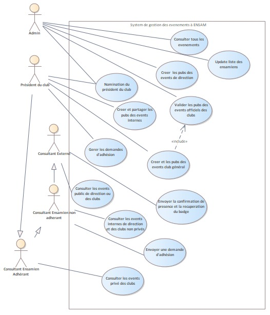

### Diagramme de classes

Ce diagramme illustre la structure des entités principales de l’application et les relations entre elles.

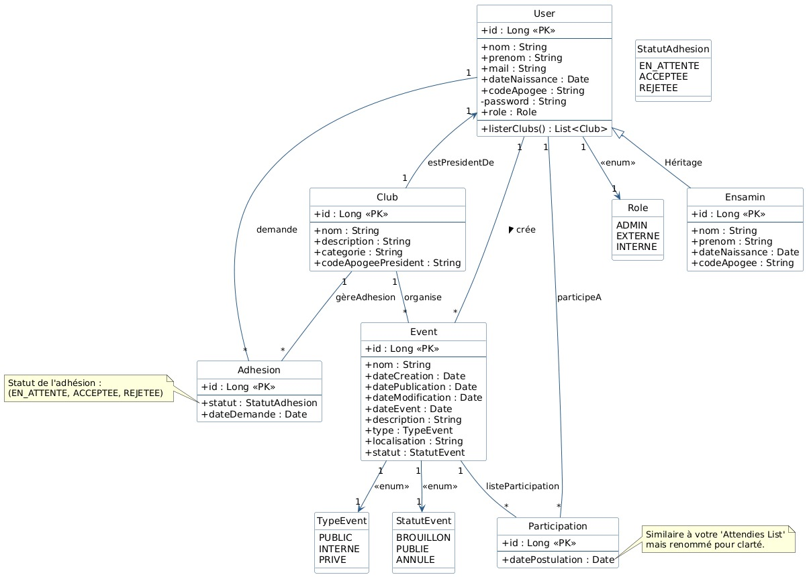

---

## Captures d’écran

### Page d’accueil et authentification

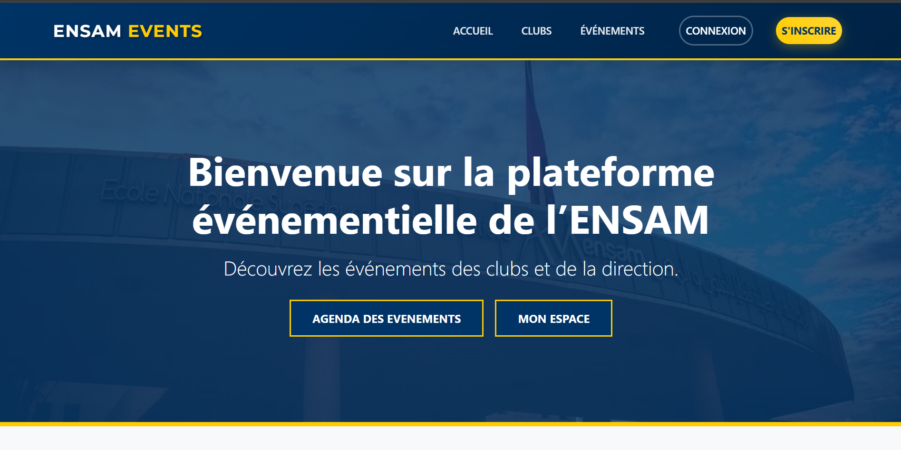
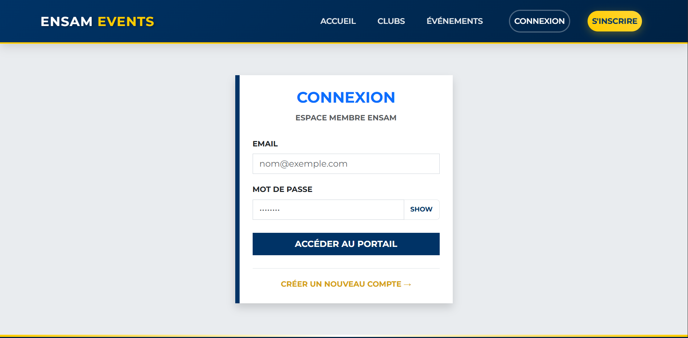
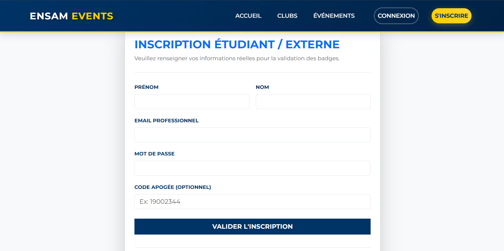

### Espace Administrateur

Les fonctionnalités administrateur sont réparties sur plusieurs écrans.

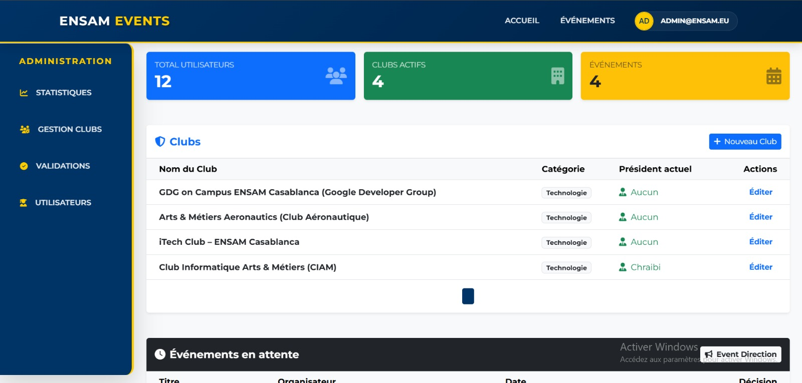
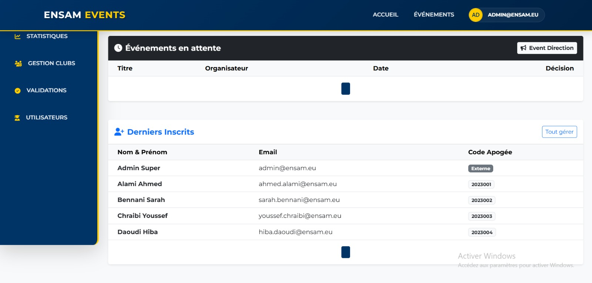
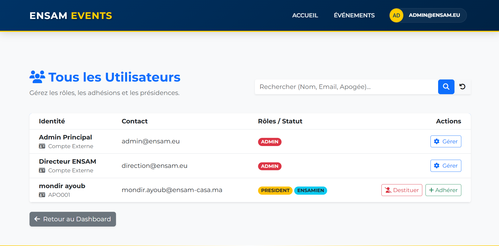
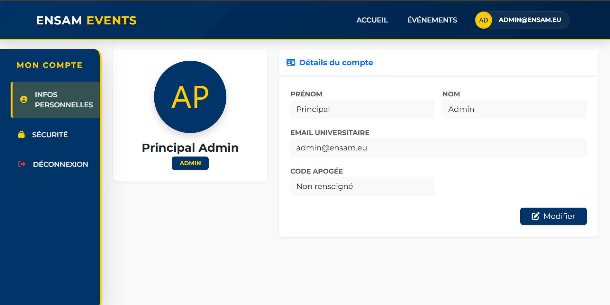

### Espace Président de club (Organisateur)

L’espace organisateur est composé de plusieurs vues complémentaires.

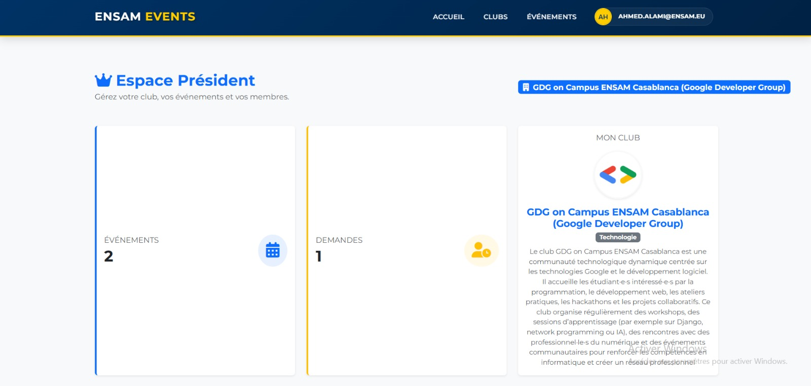
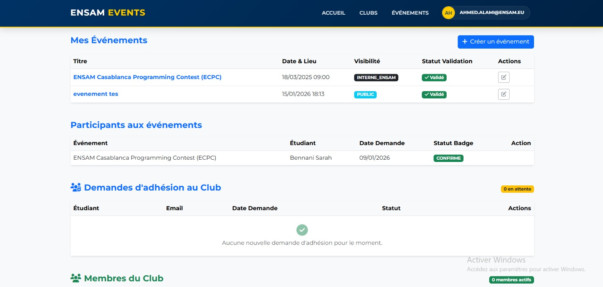
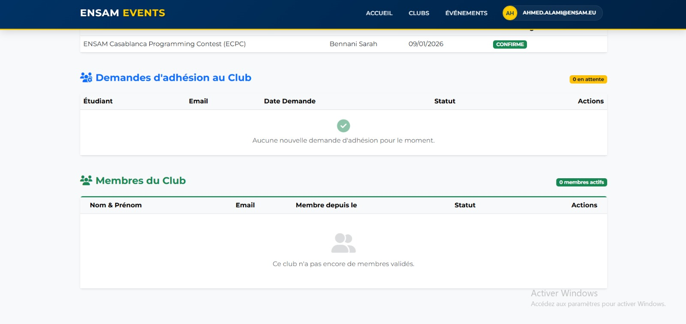

### Gestion des événements et des clubs

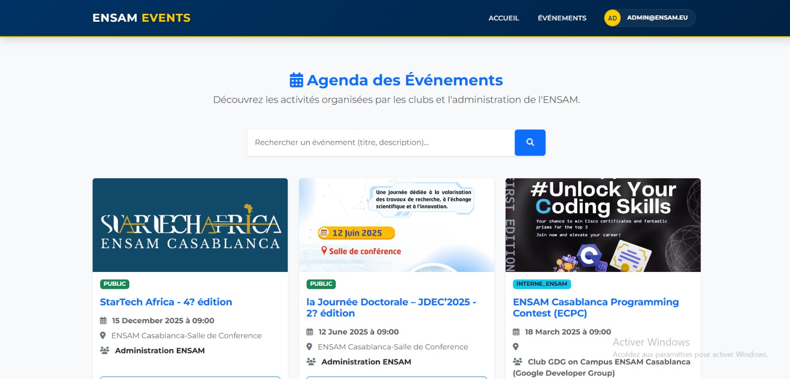

### Espace Utilisateur

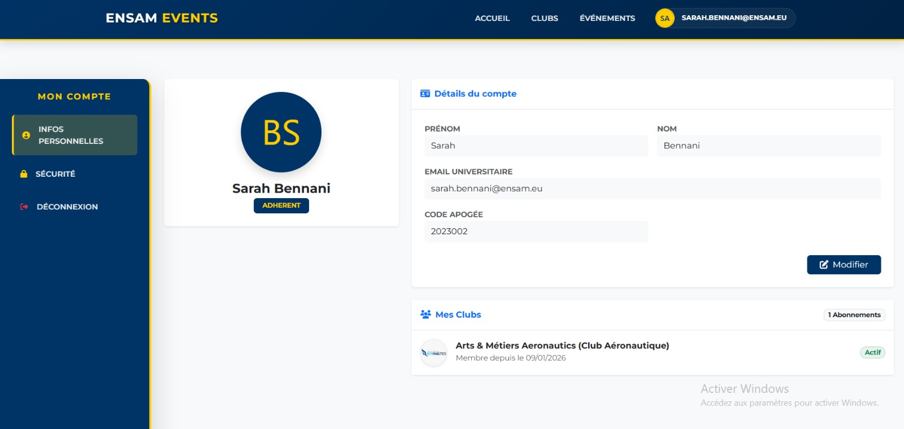
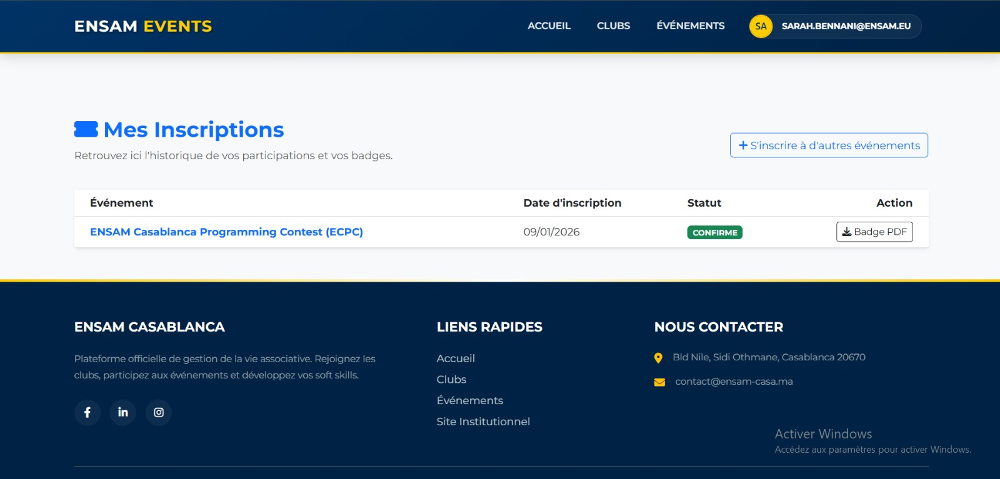
